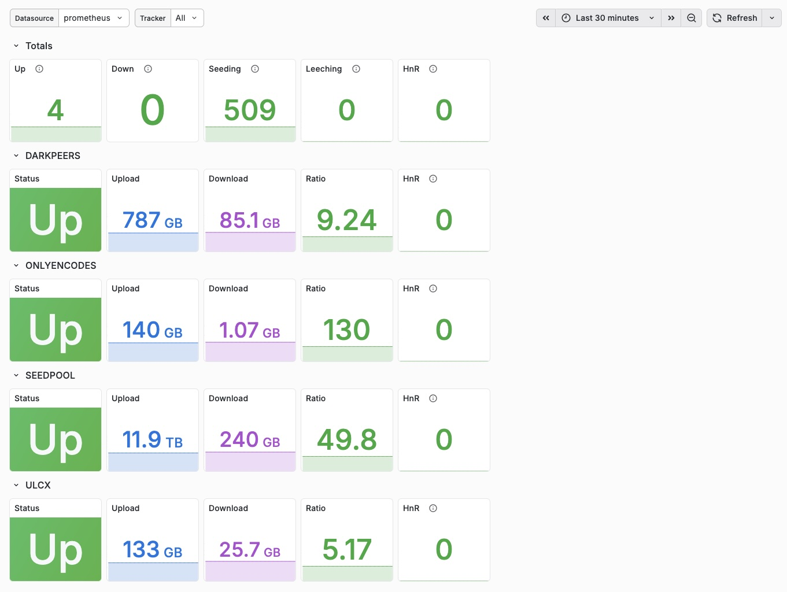

# Tracker Stats Exporter

A Prometheus exporter for private BitTorrent trackers running the [Unit3D](https://github.com/HDInnovations/UNIT3D-Community-Edition) engine (e.g., OnlyEncodes, SeedPool, etc.).

This application scrapes user metrics (Upload, Download, Buffer, Ratio, Bonus Points, Seeding, Leeching, Hit & Runs) from multiple configured trackers and exposes them on a standard Prometheus `/metrics` endpoint.

## Features

- **Multi-tracker support**: Monitor multiple trackers simultaneously.
- **Dynamic Configuration**: Configure trackers via environment variables without touching config files.
- **Standard Metrics**: Exposes comprehensive user statistics.
- **Throttling/Caching**: Configurable cache duration (default 15 minutes, minimum 5 minutes) to respect tracker API limits and avoid bans.
- **Dockerized**: Ready to deploy in any container environment.

## Configuration

Configuration is handled entirely through environment variables. You can configure as many trackers as you like using the following naming convention:

`TRACKER_{NAME}_{OPTION}`

Where `{NAME}` is a unique identifier for the tracker (e.g., `SEEDPOOL`) and `{OPTION}` is one of the required configuration keys.

### Exporter Configuration

| Variable | Description | Default |
|----------|-------------|---------|
| `EXPORTER_PORT` | The port the exporter listens on | `9100` |
| `EXPORTER_PATH` | The path metrics are exposed at | `/metrics` |
| `STATS_TTL` | Cache duration for stats (min 5m) | `15m` |
| `LOG_LEVEL` | Logging level (DEBUG, INFO, WARN, ERROR) | `INFO` |

### Required Environment Variables per Tracker

| Variable | Description | Example |
|----------|-------------|---------|
| `TRACKER_{NAME}_URL` | The base URL of the tracker | `https://seedpool.org` |

### Optional Environment Variables per Tracker

| Variable | Description | Default |
|----------|-------------|---------|
| `TRACKER_{NAME}_API_KEY` | Your API token | _(empty)_ |
| `TRACKER_{NAME}_TYPE` | The type of tracker (`UNIT3D`) | Auto-detected or `UNIT3D` |

**Note:** Currently only `UNIT3D` tracker type is supported. Other types will be ignored if specified or auto-detected.

### Global Proxy Configuration

You can configure a global proxy that will be used for all tracker requests. This is useful if you already have a container running behind a VPN with Privoxy enabled (e.g., https://hotio.dev/containers/qbittorrent/).

| Variable | Description | Example |
|----------|-------------|---------|
| `PROXY_URL` | The URL of the proxy server (HTTP/HTTPS) | `http://qbittorrent:8118` |
| `PROXY_USERNAME` | Proxy username (optional) | `myuser` |
| `PROXY_PASSWORD` | Proxy password (optional) | `mypassword` |

## Supported Trackers

At this point, only trackers based on the UNIT3D platform are supported. The following trackers are known to work:

- OnlyEncodes+ (https://onlyencodes.cc)
- SeedPool (https://seedpool.org)
- DarkPeers (https://darkpeers.org)
- ULCX (https://upload.cx)

## Metrics

The exporter exposes the following metrics at `http://localhost:9100/metrics`:

| Metric Name | Type | Labels | Description |
|-------------|------|--------|-------------|
| `tracker_upload_bytes` | Gauge | `tracker` | Total upload in bytes |
| `tracker_download_bytes` | Gauge | `tracker` | Total download in bytes |
| `tracker_buffer_bytes` | Gauge | `tracker` | Buffer in bytes |
| `tracker_ratio` | Gauge | `tracker` | User ratio |
| `tracker_bonus_points` | Gauge | `tracker` | User bonus points (seed bonus) |
| `tracker_seeding_count` | Gauge | `tracker` | Number of torrents seeding |
| `tracker_leeching_count` | Gauge | `tracker` | Number of torrents leeching |
| `tracker_hit_and_runs_count` | Gauge | `tracker` | Number of hit and runs |
| `tracker_up_status` | Gauge | `tracker` | 1 if scrape was successful, 0 otherwise |

### Grafana Dashboard

A simple dashboard is available: [simple_dashboard.json](grafana/simple_dashboard.json)



## Deployment via Docker

The image is available on GHCR (GitHub Container Registry).

### Docker CLI

```bash
docker run -d \
  --name tracker-stats-exporter \
  -p 9100:9100 \
  -e TRACKER_MYSITE_URL=https://mysite.internal \
  -e TRACKER_MYSITE_API_KEY=myapikey \
  ghcr.io/owner/tracker-stats-exporter:latest
```

### Docker Compose

```yaml
services:
  tracker-stats-exporter:
    container_name: tracker-stats-exporter
    image: ghcr.io/owner/tracker-stats-exporter:latest
    ports:
      - "9100:9100"
    environment:
      - STATS_TTL=1h # Recommended to avoid getting banned for excessive traffic
      - TRACKER_SEEDPOOL_URL=https://seedpool.org
      - TRACKER_SEEDPOOL_API_KEY=abcdef123456
      - TRACKER_ONLYENCODES_URL=https://onlyencodes.cc
      - TRACKER_ONLYENCODES_API_KEY=98765zyxw
    restart: unless-stopped
```

## Prometheus Configuration

Add the exporter target to your `prometheus.yml`:

```yaml
scrape_configs:
  - job_name: 'tracker-stats'
    static_configs:
      - targets: ['tracker-stats-exporter:9100']
```

**Note:** The application caches data for a configurable duration (default 15 minutes, min 5 minutes). Scrape intervals shorter than the configured TTL will return cached data.

## Development

1. Install dependencies:
   ```bash
   npm install
   ```
2. Build:
   ```bash
   npm run build
   ```
3. Run locally:
   ```bash
   export TRACKER_TEST_URL=https://...
   export TRACKER_TEST_API_KEY=...
   npm start
   ```
4. Run tests:
   ```bash
   npm test
   ```
